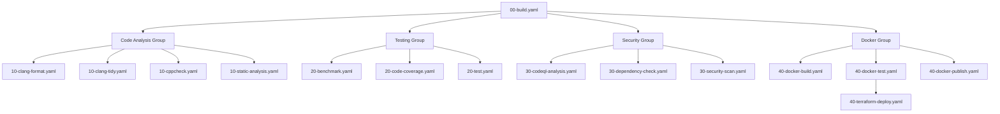

# GitHub Actions Workflows

This directory contains the CI/CD workflows for the Thales trading bot project. The workflows are organized with numeric prefixes to indicate their dependencies and execution order.

## Workflow Categories

### 00 - Core Build (Foundation)
- `00-build.yaml`: Primary build workflow that compiles the project and provides artifacts for other workflows

### 10 - Code Analysis
- `10-clang-format.yaml`: Code formatting checks
- `10-clang-tidy.yaml`: Static analysis with clang-tidy
- `10-cppcheck.yaml`: Static analysis with cppcheck
- `10-static-analysis.yaml`: Additional static analysis checks

### 20 - Testing
- `20-benchmark.yaml`: Performance benchmarking
- `20-code-coverage.yaml`: Code coverage analysis
- `20-test.yaml`: Unit and integration tests

### 30 - Security
- `30-codeql-analysis.yaml`: GitHub CodeQL analysis
- `30-dependency-check.yaml`: Dependency vulnerability scanning
- `30-security-scan.yaml`: Additional security checks

### 40 - Deployment
- `40-docker-build.yaml`: Docker image building
- `40-docker-publish.yaml`: Docker image publishing
- `40-docker-test.yaml`: Docker image testing
- `40-terraform-deploy.yaml`: AWS infrastructure deployment

### 50 - Documentation
- `50-documentation.yaml`: Documentation generation

### 60 - Platform Specific
- `60-cross-platform.yaml`: Cross-platform compatibility tests

### 90 - Maintenance
- `90-dependency-update.yaml`: Dependency updates
- `90-license-check.yaml`: License compliance checks
- `90-nightly-build.yaml`: Nightly builds
- `90-pr-build.yaml`: Pull request builds
- `90-pr-validation.yaml`: Pull request validation
- `90-release.yaml`: Release management

## Workflow Dependencies

## Workflow Execution

1. The primary build workflow (`00-build.yaml`) runs first and uploads build artifacts
2. Code analysis, testing, and security workflows can run in parallel after the build
3. Docker workflows run after successful build
4. Terraform deployment runs after successful Docker tests
5. Maintenance workflows run on their own schedules or triggers

## Environment Variables

- `UBUNTU_VERSION`: Ubuntu version for the build environment
- `AWS_REGION`: AWS region for deployment
- `TF_WORKING_DIR`: Terraform working directory

## Required Secrets

- `AWS_ROLE_ARN`: AWS IAM role ARN for deployment
- `DB_PASSWORD`: Database password for RDS
- `SSH_PRIVATE_KEY`: SSH key for EC2 access

## Artifact Sharing

Build artifacts are shared between workflows using GitHub's artifact storage:
- Build outputs from `00-build.yaml`
- Coverage reports from `20-code-coverage.yaml`
- Docker images from `40-docker-build.yaml`
